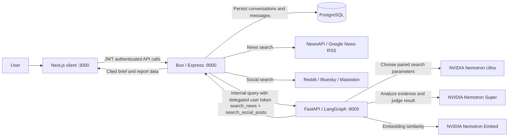

# NarrativeX

NarrativeX is a web application for investigating how a story is described across news reporting and public social conversations. It collects source material, extracts claims, compares their framing and evidence, and presents a cited research brief with evaluation details and source links.

## Project objective

The system is designed to help researchers, journalists, and curious readers:

- Search current reporting and public posts about a question or topic.
- Compare news and social narratives using closely aligned search terms.
- Identify claims, supporting and counter evidence, relationships, and unknowns.
- Track differences in emphasis and reported positions without treating popularity or repetition as proof.
- Inspect the original sources, the retrieval coverage, and the evaluation method behind each brief.
- Save investigations and export their reports as PDFs.

NarrativeX is an evidence exploration tool. Its generated assessment is a starting point for source review, not a final fact-check or a substitute for editorial judgment.

## Novelty and project contribution

NarrativeX brings several parts of narrative research into one traceable workflow:

1. **Paired cross-media collection.** A single model-planned search invokes both the news and social collection tools with the same topic. This keeps the comparison tied to a shared question rather than comparing unrelated search results.
2. **Explicit comparison contract.** A completed comparison must describe both news and social positions and cite at least one retrieved URL from each source class. If a source class is unavailable, the system shows a limitation instead of inventing agreement or disagreement.
3. **Evidence-first claim analysis.** The analysis separates claims from their evidence, records counter-evidence and uncertainty, and treats source content as untrusted input. Repetition and engagement are not considered independent confirmation.
4. **Visible evaluation and provenance.** Research briefs show LLM-judge assessments, deterministic citation and coverage checks, retrieval diagnostics, provider limitations, and the evaluated source list. These are rendered in the chat and included in the PDF report.
5. **Clear ownership boundaries.** The browser calls the NarrativeX API; the API handles authentication, storage, and provider access; the AI service plans and evaluates the investigation. Provider credentials and model calls stay server-side.

These are the system's implementation contributions, not a claim that any individual technique is new to the research field.

## Main capabilities

- Landing page and account access through credentials or Google OAuth.
- Authenticated intelligence dashboard with news, public posts, and a geopolitical headlines view.
- Research Studio with saved conversations, follow-up questions, source-linked reports, and PDF export.
- News search through NewsAPI with Google News RSS fallback.
- Public social search through Reddit, Bluesky, and Mastodon adapters.
- Partial-provider error reporting: successful sources can still be used when another provider fails.
- Structured claim assessments, cross-media comparisons, claim relationships, propagation signals, and unknowns.
- Chat toasts for API responses and clean sign-out when the server rejects an expired or invalid session.

The dashboard's geopolitical map currently places headlines using a keyword-to-city lookup. Those coordinates are illustrative matches, not verified event locations or geocoded facts.

## Architecture

| Application | Default port | Responsibilities |
| --- | ---: | --- |
| `client/` | `3000` | Next.js UI, NextAuth session, dashboard, chat, Markdown rendering, PDF download |
| `server/` | `9000` | Bun/Express API, JWT authentication, PostgreSQL persistence through Prisma, provider adapters, in-memory cache |
| `service/` | `8000` | FastAPI/LangGraph routing, model tool planning, structured analysis, evaluation and metrics |



The client does not call the AI service directly. Protected API routes are authenticated by the server, and conversation data is scoped to the signed-in user. The AI service uses the delegated token only when calling the server's protected news/social tools.

### Research request flow

1. The client sends a question to the server's conversation endpoint.
2. The server stores the user message and forwards the question, history, and delegated token to the AI service.
3. A deterministic router selects general chat or research. Research-related questions take the evidence workflow; ordinary conversation uses Groq GPT-OSS.
4. NVIDIA Nemotron Ultra makes one required call to `compare_news_and_social`, selecting the topic and bounded search parameters.
5. The tool calls the server's `search_news` and `search_social_posts` endpoints concurrently with the aligned topic.
6. The server validates, caches, and normalizes provider results. Provider errors are retained alongside successful results.
7. NVIDIA Nemotron Super analyzes up to eight selected evidence documents, with news/social evidence balanced during selection. It returns structured comparisons, claims, source URLs, relationships, and uncertainty.
8. A separate structured judge pass from Nemotron Super scores the analysis. Deterministic metrics validate citations and quantify coverage and retrieval characteristics.
9. The server stores the brief in the conversation. The client renders its Markdown tables and source links and can request a PDF copy.

The research tool boundary uses fixed server functions and validated parameters; the LLM does not receive credentials or call third-party providers directly.

## Models

Model IDs are kept in [`service/config/models.py`](service/config/models.py), not environment variables.

| Role | Model | Use |
| --- | --- | --- |
| Research search planner | `nvidia/nemotron-3-ultra-550b-a55b` | Chooses the aligned topic and bounded parameters for the paired tools |
| Evidence analyzer and judge | `nvidia/nemotron-3-super-120b-a12b` | Produces structured findings, then scores groundedness, relevance, completeness, source quality, and comparison quality |
| Embeddings | `nvidia/nemotron-3-embed-1b` | Measures query/source and claim/evidence cosine similarity |
| General conversation | `openai/gpt-oss-120b` through Groq | Answers requests routed as general conversation without retrieval |

When the embedding provider is unavailable, local TF-IDF vectors are used as a fallback and the active backend is shown in the report. Cosine similarity remains a relevance diagnostic; it does not prove entailment, factual accuracy, or truth.

## Evaluation metrics

Each completed research brief contains an **Evaluation** table and a separate **Evidence diagnostics** table. The tables are part of the saved Markdown report, so they appear in both chat and PDF output. When evaluation cannot complete, the brief still displays the evaluation measures as unavailable.

### LLM-judge assessments

All judge scores range from `0` to `1`. They are model estimates based on the request, the selected source documents, and the structured analysis:

| Measure | What it assesses |
| --- | --- |
| Groundedness | Whether findings are supported by the supplied source material |
| Answer relevance | Whether the brief addresses the user's request |
| Completeness | Whether key requested comparison points are covered |
| Source quality | The usefulness and reliability of the retrieved sources |
| Comparison quality | Whether both news and social positions are represented accurately and cited |

The judge is a separate evaluation pass, not an independent external fact-checker. Its score should be read with the citations and judge notes.

### Deterministic quality checks

| Measure | Calculation | Interpretation |
| --- | --- | --- |
| Claim citation validity | Valid claim/counter-evidence URLs ÷ all cited claim URLs | Whether claim citations point to documents in the evaluated set |
| Comparison citation validity | Comparisons with valid news and social URLs ÷ all comparisons | Whether each cross-media comparison is backed by both source classes |
| Claim evidence coverage | Claims with at least one valid citation ÷ all claims | Citation coverage, not proof that the claim is true |
| Cross-media coverage | `1` when both news and social are in the evaluated set; otherwise `0` | Confirms that the comparison had both kinds of evidence |
| Cross-media balance | `2 × min(news count, social count) ÷ total evaluated documents` | `1` means an even sample; this describes sample balance, not quality |

The internal **Weighted quality score** combines these judge and deterministic measures as follows:

```text
25% groundedness
+ 15% answer relevance
+ 10% completeness
+ 10% source quality
+ 10% comparison quality
+ 10% claim citation validity
+ 10% claim evidence coverage
+ 10% comparison citation validity
```

This is a project-level summary score, not a calibrated probability, benchmark score, or factual accuracy rating.

### Evidence diagnostics

| Diagnostic | Calculation/use | Important limit |
| --- | --- | --- |
| Query/evidence cosine | Mean cosine similarity between the request and evaluated documents | Similarity indicates topical alignment, not factual support |
| News/query and social/query cosine | Mean request-to-document cosine, shown separately by media type | Helps reveal topical imbalance between the two evidence groups |
| Claim/evidence cosine | Mean best cosine between a claim and its cited/counter-cited documents | Embedding similarity is not an entailment test; the backend is identified in the UI |
| Source diversity | Normalized Shannon entropy across source labels | Describes variety, not source independence or quality |
| Document redundancy | Mean pairwise vector cosine between documents | Similar articles can be legitimate corroboration or duplicate coverage |
| Multi-source citation rate | Share of claims citing at least two distinct source labels | Does not establish that sources are editorially independent |
| Temporal span | Time between the oldest and newest evaluated timestamps | Describes the sample window; missing timestamps reduce its coverage |

Accuracy and retrieval recall are intentionally not reported per request: they require a gold answer or reference set, which a live user question does not provide. A separate benchmark dataset with human-reviewed references is needed to measure those across versions. The current cosine and lexical retrieval-ranking functions are diagnostics, not substitutes for reference-based evaluation.

Evaluation practice follows the distinction between reference-based accuracy and reference-free groundedness/relevance assessments described in [NVIDIA NeMo Agent Toolkit](https://docs.nvidia.com/nemo/agent-toolkit/latest/workflows/evaluate.html) and [RAGAS metric guidance](https://docs.ragas.io/en/stable/concepts/metrics/available_metrics/).

## Sources and data limitations

| Source | Current access method | Credentials |
| --- | --- | --- |
| NewsAPI | `/v2/everything` search | `NEWS_API_KEY`; Google News RSS is used as fallback |
| Reddit | OAuth application-only search | `REDDIT_CLIENT_ID`, `REDDIT_CLIENT_SECRET`, and a descriptive user agent |
| Bluesky | Public post search endpoint | No API key configured by this integration |
| Mastodon | `mastodon.social` hashtag discovery and public hashtag timelines | No API key for the tested public flow |

Provider availability, rate limits, search coverage, and the amount of text returned vary. Reddit credentials are optional for running the whole application, but Reddit results will be unavailable until configured. Mastodon's unauthenticated integration searches hashtag timelines and may return no results when the topic has no discoverable hashtags. Bluesky remains subject to its endpoint's availability. Partial failures are reported; the system does not silently replace missing evidence with model-generated facts.

The evaluator selects at most eight documents for analysis, attempting to preserve a four-news/four-social split. News providers may return excerpts rather than full articles, and public social search does not expose private or restricted posts. The dashboard's geopolitical map is a keyword-based illustration as described above.

## API surface

The browser talks to the NarrativeX server, not the AI service.

| Method and path | Access | Purpose |
| --- | --- | --- |
| `POST /api/auth/signup` | Public | Create a credentials account |
| `POST /api/auth/signin` | Public | Sign in and receive the server JWT |
| `POST /api/auth/google` | Public | Resolve Google identity to a NarrativeX account/JWT |
| `GET /api/news/search?q=...` | JWT | Search normalized news articles |
| `POST /api/social/search` | JWT | Search social providers with `topics`, optional `platforms`, and `limit` |
| `GET /api/events/geopolitics?limit=...` | JWT | Return keyword-matched headlines for the dashboard map |
| `GET/POST /api/conversation` | JWT | List or create a user's conversations |
| `GET/POST /api/conversation/chat/:conversationId` | JWT | Load messages or submit a question and receive a saved report |
| `GET /api/conversation/report/:conversationId` | JWT | Export a conversation report as PDF |
| `POST /api/agent/query` | Internal service call | Run the AI workflow; clients should use conversation routes instead |

For social search, the server accepts a body like:

```json
{
  "topics": ["AI regulation"],
  "platforms": ["reddit", "bluesky", "mastodon"],
  "limit": 10
}
```

The social response returns normalized `posts` and per-provider `errors`. Omit `platforms` to search all configured sources.

## Local development

Requirements: Bun, Python 3.12 (or a version supported by the pinned dependencies), and a PostgreSQL database compatible with the Prisma contract.

Copy the example environment files and configure the database, auth secrets, and provider keys:

```bash
cp client/.env.example client/.env
cp server/.env.example server/.env
cp service/.env.example service/.env
```

Set `server/.env`'s `DATABASE_URL` to your PostgreSQL instance. Replace the example `JWT_SECRET` and `NEXTAUTH_SECRET` with private random values. Configure `NVIDIA_API_KEY` for research planning, analysis, judging, and embeddings. Configure `GROQ_API_KEY` for general conversation. `NEWS_API_KEY` and Reddit credentials enable those providers; RSS, Bluesky, and Mastodon do not require keys in the current adapters.

Install and start each service in its own terminal from the repository root:

```bash
cd server
bun install
bun run dev
```

```bash
cd service
python -m venv .venv
source .venv/bin/activate
python -m pip install -r requirements.txt
uvicorn app:app --host 0.0.0.0 --port 8000 --reload
```

```bash
cd client
bun install
bun run dev
```

The client is at `http://localhost:3000`, the API is at `http://localhost:9000`, and the AI service is at `http://localhost:8000`. By default the server calls the AI service at port `8000`, and the AI service calls the server at port `9000`. Keep the latter reachable from the service process because it uses the delegated JWT to collect sources.

For database setup or contract changes, review [`server/src/prisma/contract.prisma`](server/src/prisma/contract.prisma) and the available scripts in [`server/package.json`](server/package.json). The repository currently does not include a PostgreSQL container or a seed dataset.

### Environment variables

| File | Important settings |
| --- | --- |
| `client/.env` | `NEXT_PUBLIC_HTTP_SERVER_BASE_URL`, `NEXTAUTH_SECRET`, optional Google OAuth client ID and secret |
| `server/.env` | `PORT`, `DATABASE_URL`, `JWT_SECRET`, optional `NEWS_API_KEY` and Reddit OAuth credentials |
| `service/.env` | `PORT`, `SERVER_BASE_URL`, `NVIDIA_API_KEY`, `GROQ_API_KEY` |

Provider model IDs are not environment variables. They are defined in `service/config/models.py`.

## Docker Compose (optional)

The default workflow above runs the services natively. Compose is available for users who want containerized application services:

```bash
docker compose up --build
```

Compose reads the three `.env` files. PostgreSQL is not included, so `DATABASE_URL` must point to a database reachable from the server container; `localhost` inside a container refers to that container. The AI service is private to the Compose network, while the client and API publish ports `3000` and `9000` by default. `CLIENT_HOST_PORT` and `SERVER_HOST_PORT` can override the host ports.

## Verification

Run the server checks:

```bash
cd server
bun test
bun run build
```

Run the service checks:

```bash
cd service
python -m unittest discover -s tests -v
```

Run the client lint and production build:

```bash
cd client
bun run lint
bun run build
```

Static checks do not verify access to third-party providers or model APIs. Live results depend on configured credentials, provider availability, and model access.

## Project layout

```text
client/   Next.js app, auth pages, dashboard, research chat, PDF client
server/   Express routes/controllers, provider adapters, Prisma contract, PDF generation
service/  FastAPI routes, LangGraph, research tools, evaluation and mathematical metrics
docker/   Service Dockerfiles
compose.yaml
```
